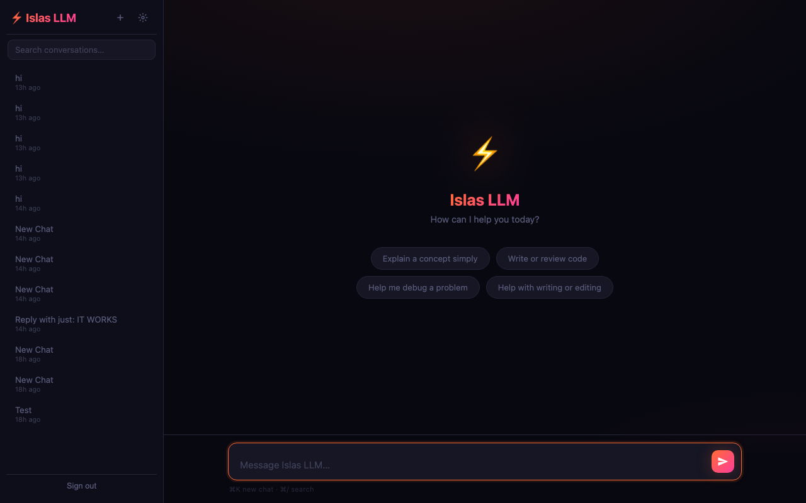
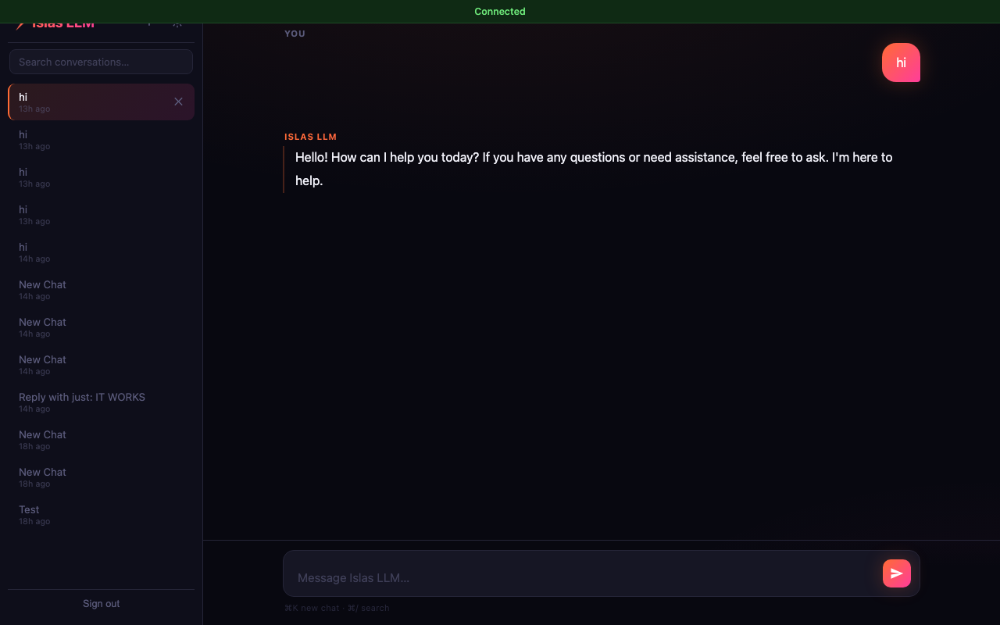

# ⚡ Islas AI

A fully custom AI chat product built from the ground up — Mistral 7B running locally on Apple Silicon, served publicly at **[islas-ai.com](https://islas-ai.com)** via Cloudflare Tunnel with CI/CD auto-deploy on every push.

---





---

## Features

- **Local inference** — Mistral 7B Instruct (4-bit) via Apple MLX, no API costs, runs entirely on-device
- **WebSocket streaming** — real-time token-by-token responses with auto-reconnect and ping keepalive
- **Token batching** — tokens buffered and flushed every 6 tokens or 30 ms, reducing frame overhead
- **KV cache** — per-session KV cache so only new tokens are prefilled each turn
- **Token-aware context trimming** — oldest messages dropped to stay within Mistral's 4096-token limit
- **Per-user isolation** — each browser gets its own private chat history via a localStorage user ID, no login required
- **Persistent conversations** — all chats saved to SQLite (WAL mode, 32 MB page cache)
- **Startup warm-up** — dummy inference at boot compiles MLX compute graphs for consistent first-response latency
- **Edit & regenerate** — edit any past message and regenerate from that point
- **System prompt** — configurable per conversation via the settings panel
- **Temperature & max tokens** — adjustable per session
- **Export** — download any conversation as a markdown file
- **Feedback reporting** — in-app issue reporting stored to DB, viewable by the developer
- **Mobile responsive** — works on iPhone and Android with safe-area insets and virtual keyboard handling
- **Daily backups** — SQLite database backed up automatically every day, retaining the last 7 snapshots
- **Security** — HSTS, CSP, CORS, GZip, IP-based rate limiting, UUID-validated user IDs, secure session cookies
- **CI/CD** — GitHub Actions self-hosted runner auto-deploys to the live server on every push to `main`
- **Cloudflare Tunnel** — permanently exposed at `islas-ai.com` with no open ports or port forwarding

## Stack

| Layer | Technology |
|-------|------------|
| Model | Mistral 7B Instruct (4-bit, MLX) |
| Backend | FastAPI + WebSockets + SQLite |
| Frontend | Vanilla JS, marked.js, highlight.js, DOMPurify |
| Deployment | Cloudflare Tunnel + GitHub Actions (self-hosted runner) |
| Platform | Apple Silicon (M-series) |

## Live Demo

**[islas-ai.com](https://islas-ai.com)** — open to anyone, no account required. Each visitor gets their own private conversation history.

## Quick Start

**Requirements:** Python 3.12+, Apple Silicon Mac (M1/M2/M3/M4)

```bash
# Clone
git clone https://github.com/islas104/islas-llm.git
cd islas-llm

# Install dependencies
python3 -m venv .venv
source .venv/bin/activate
pip install -r requirements.txt

# Configure
cp .env.example .env
# Add your HuggingFace token to .env

# Run
python run.py
```

Open [http://localhost:8000](http://localhost:8000)

## Deployment

The app runs on a local Mac and is exposed publicly via a named Cloudflare Tunnel. Every `git push` to `main` triggers a GitHub Actions self-hosted runner that pulls the latest code, installs dependencies, and restarts the server automatically.

```
git push origin main  →  GitHub Actions  →  pull + restart  →  islas-ai.com updated
```

To view user feedback reports:
```bash
sqlite3 forge.db "SELECT datetime(created_at/1000, 'unixepoch'), message FROM feedback ORDER BY created_at DESC;"
```

## Project Structure

```
islas-llm/
├── model/
│   └── loader.py          # MLX model loading, KV cache, warm-up
├── api/
│   ├── auth.py            # Session management, user ID extraction
│   ├── db.py              # SQLite — WAL, indexes, all DB helpers
│   ├── main.py            # FastAPI app, middleware, security headers
│   └── routes/
│       ├── chat.py        # WebSocket handler — streaming, token batching, timeout
│       ├── conversations.py
│       ├── feedback.py    # In-app issue reporting
│       └── auth_routes.py
├── ui/
│   ├── index.html         # Chat interface
│   ├── login.html         # Auth page
│   ├── app.js             # WebSocket client, markdown rendering, feedback modal
│   ├── login.js           # Login form logic
│   └── style.css          # Dark theme, gradient accents, mobile-responsive
├── .github/
│   └── workflows/
│       └── deploy.yml     # CI/CD — auto-deploy on push to main
├── screenshots/
├── scripts/
│   ├── backup.sh          # Daily SQLite backup (run via launchd)
│   └── finetune.py        # QLoRA fine-tuning
├── setup.py               # First-run password setup
├── run.py                 # Server entrypoint
└── .env.example
```

## Environment Variables

| Variable | Description | Default |
|----------|-------------|---------|
| `MODEL_ID` | HuggingFace model ID | `mlx-community/Mistral-7B-Instruct-v0.3-4bit` |
| `HF_TOKEN` | HuggingFace access token | — |
| `PORT` | Server port | `8000` |
| `PASSWORD_HASH` | scrypt hash (run `setup.py`) — optional | — |
| `MAX_NEW_TOKENS` | Max tokens per response | `1024` |
| `TEMPERATURE` | Default sampling temperature | `0.7` |
| `MAX_CONTENT_LEN` | Max characters per user message | `8000` |
| `ALLOWED_ORIGINS` | CORS allowed origins | `http://localhost:8000` |

---

Built by [Islas Nawaz](https://github.com/islas104)
